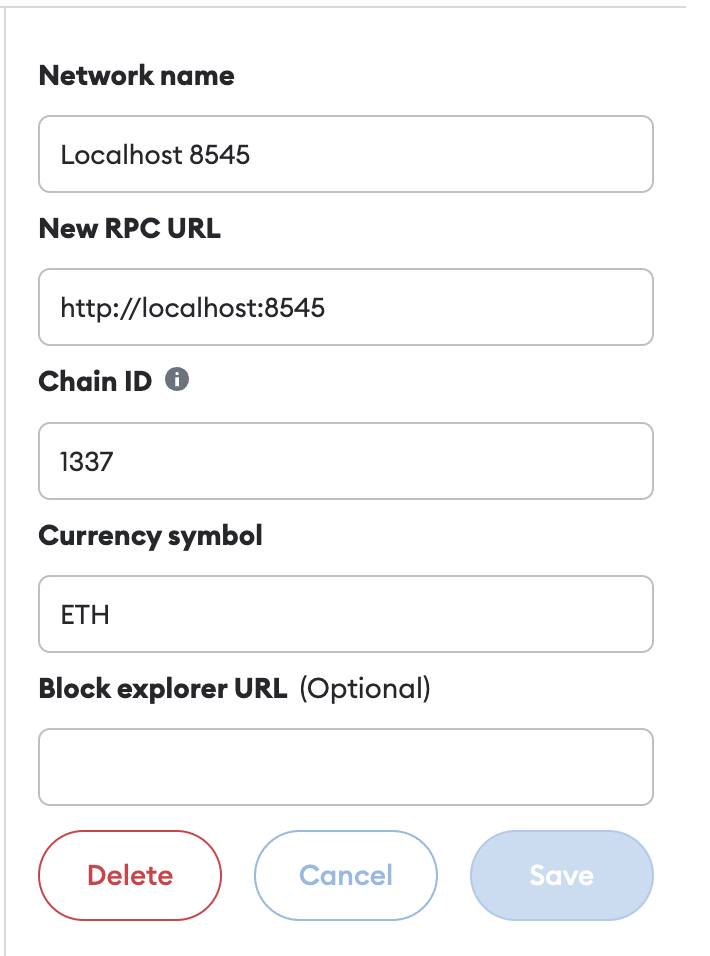

# Introduction
This project is an introduction to smart contract, integrating it with javascript

# Structure
* [3-truffle-project/](3-truffle-project): Build, test and deploy smart contract to local blockchain
* [4-game-in-html/](4-game-in-html): Integrate smart contract with the web.
  * [contracts/](4-game-in-html/contracts): Smart contracts
  * [app/](4-game-in-html/app): The frontend code

# Local development
* Install ganache: `npm install -g ganache-cli`
* Install truffle: `npm install-g truffle`
* Start ganache, which runs a local blockchain at localhost:8545: `ganache-cli`
* Run truffle migration to deploy the smart contracts: `truffle migrate`
* Start frontend: `npm run dev`
* Build frontend: `npm run build`

## Connect to metamask
**Localhost**

# Demo - localhost
[Try it here](https://hanchiang.github.io/complete-crypto-currency-and-blockchain-course-learn-solidity/)

**2 incognito windows**

**non-incognito(metamask) and incognito window**

# Deploy to testnet
* cd `4-game-in-html`
* Create `.env` file with the following variables:
  * `MNEMONIC`: From ganache
  * `PROJECT_ID`: Create a project in [infura](https://www.infura.io/)
* `truffle migrate --network sepolia`

## Sepolia testnet
**Contract**
https://sepolia.etherscan.io/address/0x70bafdcb86bf63b9d2d0c0519d8cefd9ba166a8b

**Faucet**
https://www.infura.io/faucet/sepolia  
https://sepoliafaucet.com/  
https://faucets.chain.link/